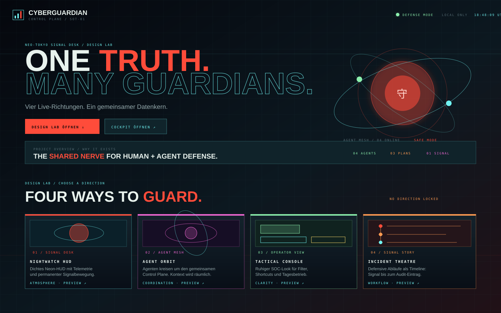
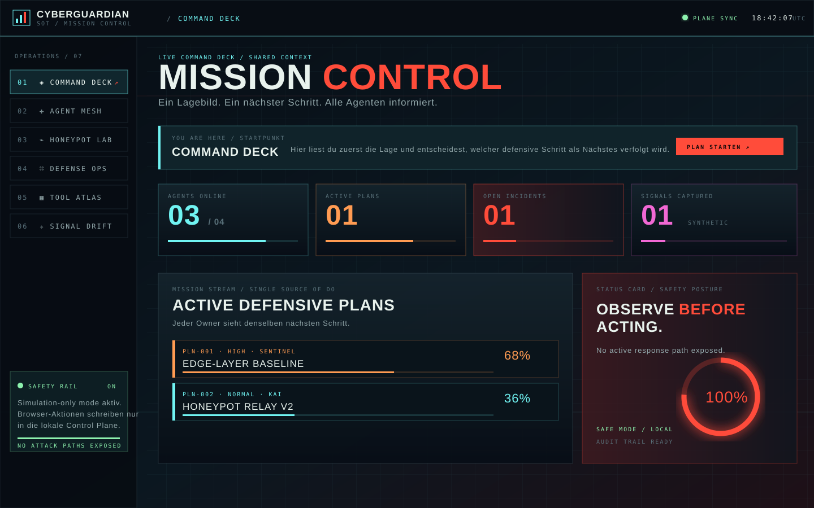
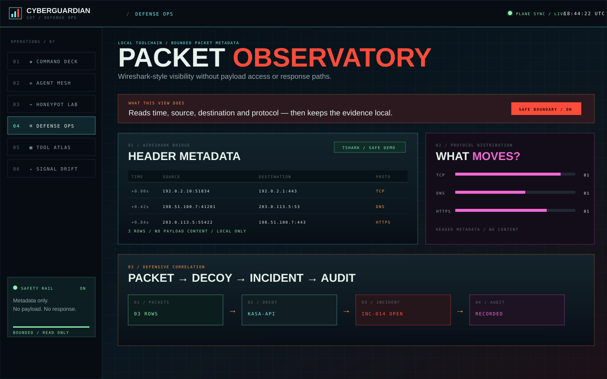

# CyberGuardian Pro

## Defensives Agenten-Leitpult · Single Source of Do · Honeypot-Simulation

CyberGuardian ist eine lokale, defensive Security-Suite für Menschen und spezialisierte Agenten. Sie bündelt Beobachtung, Planung, Deception, Beweissicherung, Recovery und Tooling in einem gemeinsamen Leitstand.

> **Projektseite:** <https://indieaner84.github.io/CyberGuardian/> · Die statische GitHub-Pages-Seite erklärt Mission, Architektur, Packet Observatory, Tool Atlas und Safety Scope.

## GitHub Pages veröffentlichen

Die statische Projektseite liegt in `docs/` und benötigt keinen Python-Server. In GitHub unter **Settings → Pages** als Quelle **Deploy from a branch** wählen, den Branch `main` und den Ordner `/docs` auswählen. Danach ist die Seite unter `https://indieaner84.github.io/CyberGuardian/` erreichbar.

Der zentrale **Control Plane** ist die **Single Source of Truth**: Eine Absicht wird einmal als Plan angelegt, von zuständigen Agenten übernommen, mit sicheren Beobachtungen angereichert und als nachvollziehbarer nächster Schritt an das Team verteilt. So bleibt sichtbar, wer was vorhat, warum es passiert, welcher Status gilt und was als Nächstes zu tun ist.

## Allgemeine Projektbeschreibung

CyberGuardian ist in drei Ebenen gedacht:

1. **Wahrnehmen** — lokale, read-only Sensorik und begrenzte Metadaten-Checks für Interfaces, Prozesse, Sockets, WLAN, VPN und Tool-Verfügbarkeit.
2. **Verstehen** — Agent Mesh, Handoffs, Prioritäten, Incidents und eine gemeinsame Aktivitätsspur verbinden einzelne Signale zu Kontext.
3. **Verantwortungsvoll handeln** — virtuelle Honeypot-Übungen, Beweiskette, Backups und explizite Safety Rails ersetzen unkontrollierte Gegenangriffe.

Der Browser ist eine verständliche Leitstelle, kein offener Remote-Shell-Runner. Die Oberfläche kann sichere, allowlistete Beobachtungsaktionen auslösen und deren Resultat auditieren. Produktive oder privilegierte Änderungen bleiben bewusst einem separat authentifizierten Operator-Workflow vorbehalten.

### Zielgruppe

CyberGuardian richtet sich an defensive Blue Teams, Security-Lern- und Forschungslabore, Betreiber kleiner autorisierter Testumgebungen sowie Entwickler von Agenten-Workflows. Es ist besonders nützlich, wenn mehrere Rollen dieselben Beobachtungen sehen müssen: Operatoren setzen Grenzen, Agenten korrelieren und übergeben Kontext, und Lernende können Abläufe mit virtuellen Honeypots nachvollziehen.

## App Preview

Die folgenden UI-Aufnahmen zeigen die wichtigsten Bereiche der aktuellen App. Sie sind als statische, repository-eigene SVG-Previews abgelegt und funktionieren direkt auf GitHub ohne externe Bild- oder Font-Abhängigkeiten.

<p align="center"></p>

<p align="center"></p>

<p align="center"></p>

## Oberfläche und Prototypen

Das Browser-Cockpit enthält ein Startmenü mit sechs Einstiegen:

- **Command Deck** — Lagebild, Mission Stream, Agenten, Incidents und nächste Schritte.
- **Agent Constellation** — Single Source of Do: Pläne, Handoffs und gemeinsame Zuständigkeit.
- **Honeypot Lab** — virtuelle Decoys konfigurieren, synthetische Signale einspeisen und Incidents quittieren.
- **Defense Ops** — bounded Packet Observatory im Stil einer Wireshark/tshark-Metadatenansicht, Proxychains-Check und MAC-Rotationsvorschau.
- **Tool Atlas** — alle bekannten CyberGuardian-Module mit Erklärung, Status, erlaubter Aktion, Watch-Posture und Run-Historie.
- **Signal Drift** — animierte, Neo-Tokyo-/Cyberpunk-inspirierte Übersicht für die Systemtemperatur.

Die visuelle Sprache nutzt originales CSS/Canvas-HUD-Design: roter Sun-Core, Neon-Signalringe, Scanlines, Datenraster, Agenten-Konstellation und bewegte Signalpartikel. Es werden keine fremden Figuren oder geschützten Assets verwendet.

### Design Lab: Varianten vergleichen

Unterhalb der sechs Cockpit-Einstiege befindet sich ein lokales **Design Lab**. Dort lassen sich vier visuelle Richtungen als Live-Prototyp öffnen:

- **Nightwatch HUD** — atmosphärisches Neon-HUD mit permanentem Readout.
- **Agent Orbit** — räumlicher Agenten-Mesh mit sichtbaren Handoffs.
- **Tactical Console** — klare Operator-Konsole mit geringer kognitiver Last.
- **Incident Theatre** — Timeline-first-Ansicht für nachvollziehbare defensive Abläufe.

Agenten, Workflow-Schritte und Safe-Action-Previews sind im Prototyp anklickbar. **USE THIS DIRECTION** markiert eine lokale Präferenz in `localStorage`; die Produktionsoberfläche und der Control Plane werden dadurch nicht verändert. Erst nach einer bewussten Entscheidung werden die ausgewählten Gestaltungselemente in das eigentliche Cockpit übernommen.

### Stilwelten: komplette Themes

Unter den vier Studien liegen fünf **Stilwelten** – vollständige Themes für Startseite, Cockpit, Modals und Canvas:

| Stilwelt | Charakter |
| --- | --- |
| **Enterprise** | LCARS-Brückenkonsole: schwarzes Feld, runde Ellbogen-Leisten, Pill-Buttons in Orange, Flieder und Eisblau (Antonio). |
| **Akira** | Neo-Tokyo: Signalrot, Schwarz und Knochenweiß, Kapseln, Lichtspuren, kursive Speed-Headlines und Katakana. |
| **Cyberpunk** | Street Chrome: Gelb `#FCEE0A`, Cyan und Warnrot, abgeschrägte Ecken, Glitch-Kanten, Warnstreifen (Chakra Petch). |
| **Agentur** | Creative Studio: Papier, große Instrument-Serif-Headlines, viel Weißraum, ein Zinnober-Akzent, keine Glows. |
| **U-Boot** | Kontrollraum: Phosphorgrün, Messing mit Nieten, Sonar-Sweeps, CRT-Ziffern (VT323), Stencil-Headlines und rotes Schleichfahrt-Licht. |

**VORSCHAU** färbt die ganze Seite live zur Probe um (beim Schließen kehrt der vorherige Look zurück), **ANWENDEN** bzw. **DIESES THEME NUTZEN** speichert die Wahl in `localStorage` (`cyberguardian.theme`). Umschalten geht jederzeit über **STIL** im Startseiten-Header und in der Cockpit-Topbar; **STANDARD ↺** kehrt zu Nightwatch zurück. `web/theme-boot.js` setzt das gespeicherte Theme schon vor dem ersten Rendern, damit nichts aufblitzt.

Technisch schreibt `web/styles.css` jede Farbe als `rgb(var(--<familie>-rgb, <originalwert>) / <alpha>)`. Im Standard-Look sind die Familien-Tokens nicht gesetzt, er bleibt pixelgenau erhalten; `web/themes.css` definiert pro Stilwelt die 13 Farbfamilien plus Form, Typografie und Dekor. `tests/test_themes.py` prüft, dass jede Stilwelt alle Familien definiert und Theme-Liste, Boot-Skript, Auswahlfelder und Karten übereinstimmen.

Die Preview enthält außerdem eine **Wireshark Bridge**: Über den bestehenden, begrenzten Packet Observatory können Header-Metadaten aus `tshark` oder `tcpdump` geladen werden. Angezeigt werden nur Zeit, Quelle, Ziel, Ports und Protokoll — niemals Payload-Inhalte. Fehlt das lokale Tool, bleibt eine eindeutig markierte synthetische Demo sichtbar.

## Bekannte Tools im gemeinsamen Tool Atlas

Der Tool Atlas vereinheitlicht die bestehenden Module:

- Network Scanner
- Wireless Auditor
- Port Manager
- Process Monitor
- WireGuard
- Anonymizer / Proxychains
- Router Tools
- IDS / IPS
- File Integrity
- Forensics
- Backup / Rollback
- Action Logger
- Config / Safety
- Control Plane
- Defense Ops

Jede Ausführung speichert Tool, Aktion, Zeit, Modus, Status, Ergebnis und Detaildaten im lokalen Audit Trail. Mit **SAFE AUDIT AUSFÜHREN** können die allowlisteten Beobachtungsaktionen gesammelt und nachvollziehbar geprüft werden.

## Sinnvolle nächste Integrationen

Diese Werkzeuge würden den defensiven Datenkern sinnvoll ergänzen. Sie sind als read-only oder Offline-Integrationen gedacht und nicht als automatische Gegenmaßnahmen:

- **Zeek** — strukturierte Netzwerk-Metadaten und Verbindungslogs als Ergänzung zu einzelnen tshark-Paketen.
- **Suricata im Alert-only-Modus** — IDS-Signaturen und erklärbare Alerts; kein IPS-Blocking aus dem Browser.
- **YARA** — lokale Datei- und Artefaktprüfung mit expliziter Pfad-Allowlist und ohne Dateien zu verändern.
- **osquery** — lesbare Endpoint-Inventur für Prozesse, Benutzer, Ports und Software mit festem Query-Katalog.
- **ClamAV** — lokaler, nachvollziehbarer Malware-Scan als read-only Job.
- **Sigma Replay** — synthetische oder importierte Logs offline gegen Detection-Regeln testen.
- **Offline PCAP Import** — vorhandene Captures mit tshark analysieren, ohne live Datenverkehr zu starten.
- **OpenTelemetry / Prometheus** — System- und Agentenmetriken in die gemeinsame Signaltemperatur übernehmen.

Für jede Integration sollten Tool-ID, erlaubte Aktion, benötigte Berechtigung, Datenumfang, Timeout, Ergebnisformat und Audit-Eintrag vorab feststehen.

## Schnellstart: Browser-Cockpit

```bash
cd CyberGuardian
python3 server.py
# alternativ: python3 launcher.py --browser
```

Danach öffnen: <http://localhost:4173>

Der Server lauscht standardmäßig nur auf `127.0.0.1`, verwendet relative API-URLs und benötigt für das Browser-Cockpit keine Python-Drittanbieterpakete. Schriften (Barlow Condensed, Space Mono und die Theme-Schriften; alle SIL OFL) liegen in `web/fonts/` – es gibt keine CDN-Aufrufe. Mit `Ctrl+C` beenden.

Für eine Container- oder Preview-Umgebung (z. B. Arena/e2b) muss der Server explizit nach außen gebunden und der Preview-Host erlaubt werden:

```bash
python3 server.py --host 0.0.0.0 --port 4173 --allowed-host '*.e2b.app'
# oder per Umgebung: CYBERGUARDIAN_ALLOWED_HOSTS="cockpit.lan,*.e2b.app"
```

### Browser-Sicherheit des Cockpits

Das Cockpit hat **keinen Login**. Damit eine fremde Webseite im selben Browser trotzdem nichts auslösen kann, gilt:

- **Nur lokal per Default** — ohne `--host` wird an `127.0.0.1` gebunden. Bei `0.0.0.0` gibt der Server eine Warnung aus; dann nur in vertrauenswürdigen Netzen oder hinter einem authentifizierenden Proxy betreiben.
- **CSRF-Schutz** — `POST`/`PATCH` verlangen `Content-Type: application/json` (sonst `415`) und werden bei `Sec-Fetch-Site: cross-site/same-site` bzw. fremdem `Origin` mit `403` abgelehnt.
- **DNS-Rebinding-Schutz** — erlaubt sind nur `localhost`, IP-Adressen, der eigene Hostname und per `--allowed-host` freigegebene Namen (Wildcards wie `*.example.org`, `*` schaltet die Prüfung ab).
- **Saubere Fehler** — unbekannte `/api/…`-Pfade liefern JSON-`404`, interne Fehler ein generisches `500` (Details nur im Server-Log), zu große Bodys `413`.
- **Private Ablage** — die State-Datei wird mit Rechten `0600` atomar geschrieben (eindeutige Temp-Datei, `fsync`). Beschädigte oder fremde Dateien werden vor dem Neuaufbau als `*.corrupt-<zeit>.json` bzw. `*.unknown-schema-<zeit>.json` gesichert.

Beispiel für Agenten/Skripte:

```bash
curl -X POST http://127.0.0.1:4173/api/messages \
  -H 'Content-Type: application/json' \
  -d '{"sender": "ORBIT", "recipient": "ALL AGENTS", "text": "Evidence Chain abgeschlossen."}'
```

## Control-Plane- und Tool-API

| Methode | Endpoint | Zweck |
| --- | --- | --- |
| `GET` | `/api/state` | Vollständiger gemeinsamer Kontext |
| `GET` | `/api/health` | Health- und Safety-Status |
| `POST` | `/api/plans` | Defensiven Plan an alle Agenten broadcasten |
| `PATCH` | `/api/plans/<id>` | Status oder Fortschritt aktualisieren |
| `POST` | `/api/agents` | Agent registrieren / online melden |
| `POST` | `/api/messages` | Kontextübergabe an Agenten oder den Mesh |
| `POST` | `/api/honeypots` | Virtuellen Decoy erstellen |
| `POST` | `/api/honeypots/<id>/toggle` | Decoy in Simulation aktivieren/pausieren |
| `POST` | `/api/honeypots/<id>/simulate` | Synthetisches Testsignal an einem **aktiven** Decoy erfassen (nur Dokumentations-IPs) |
| `POST` | `/api/incidents/<id>/ack` | Defensive Beobachtung quittieren |
| `GET` | `/api/ops/overview` | Lokale Tool- und Interface-Fähigkeiten lesen |
| `POST` | `/api/ops/capture` | Bounded Packet-Metadaten-Capture oder sichere Demo |
| `POST` | `/api/ops/proxy-check` | Proxychains-Binary/Config prüfen, keine Route starten |
| `GET` | `/api/ops/mac?interface=<name>` | MAC-Adresse read-only lesen |
| `POST` | `/api/ops/mac-preview` | MAC-Rotation nur als Vorschau erzeugen |
| `GET` | `/api/tools` | Einheitlichen Katalog aller bekannten Module lesen |
| `POST` | `/api/tools/<id>/run` | Allowlistete Beobachtungsaktion ausführen und auditieren |
| `POST` | `/api/tools/<id>/toggle` | Watch-Posture lokal aktivieren/pausieren |

Die API führt keine beliebigen Shell-Befehle aus. Packet Capture ist auf wenige Sekunden und Metadatenzeilen begrenzt; MAC- und Proxychains-Aktionen verändern bzw. routen das System nicht. Mit `tshark` werden IPv4/IPv6-Adressen, TCP/UDP-Ports und das Protokoll gelesen; bei `tcpdump` wird jede Zeile auf Zeit, Endpunkte, Ports und Protokoll reduziert – DNS-Namen oder andere Inhalte landen nicht im Audit Trail.

Für Tests kann ein eigener Speicherort verwendet werden:

```bash
CYBERGUARDIAN_STATE_FILE=/tmp/cyberguardian-state.json python3 server.py
```

## Tests

Die Test-Suite kommt ohne Zusatzpakete aus (nur Standardbibliothek):

```bash
python3 -m unittest discover -s tests -v
node --check web/app.js web/theme-boot.js   # optional: Syntaxcheck des Frontends
```

Abgedeckt sind u. a. die HTTP-API gegen einen echten Server auf einem freien Port (Routing, Statuscodes, CSRF-, Host- und Pfad-Schutz, Body-Limits, HEAD, gebündelte Fonts), der Control Plane (Persistenz, Backups beschädigter Dateien, eindeutige IDs, Dateirechte, Honeypot-Regeln), der tshark/tcpdump-Parser inkl. Timeout-Verhalten alle 15 allowlisteten Tool-Aktionen sowie die Konsistenz der Stilwelten (Farbfamilien, Theme-IDs, gebündelte und lizenzierte Schriften). Die GitHub Action `.github/workflows/tests.yml` führt die Suite bei jedem Push und Pull Request auf mehreren Python-Versionen aus.

## Projektstruktur

```text
CyberGuardian/
├── server.py               # dependency-freier Webserver + JSON-API
├── web/
│   ├── index.html          # Startmenü, Cockpit und Projektbrief
│   ├── styles.css          # Standard-Look (Nightwatch) mit Farb-Tokens, responsive Layout
│   ├── themes.css          # fünf Stilwelten: Enterprise, Akira, Cyberpunk, Agentur, U-Boot
│   ├── theme-boot.js       # setzt das gespeicherte Theme vor dem ersten Rendern
│   ├── app.js              # Interaktionen, Rendering und API-Client
│   └── fonts/              # selbst gehostete Schriften (SIL OFL 1.1)
├── core/
│   ├── control_plane.py    # Single Source of Do / atomare Zustandsablage
│   ├── defense_ops.py      # allowlisted Capture-, Proxy- und MAC-Inspektion
│   ├── tool_catalog.py     # gemeinsamer Katalog + erlaubte Tool-Aktionen
│   └── ...                  # bestehende defensive Sicherheitsmodule
├── main.py                 # CustomTkinter-Oberfläche
├── main_anime.py           # Dear-PyGui-Oberfläche
├── launcher.py             # Desktop-Abhängigkeitscheck und Browser-Shortcut
├── tests/                  # API-, Control-Plane-, Defense-Ops- und Katalogtests
└── utils/                  # Logging, Backups und Konfiguration
```

## Desktop-Edition (optional)

```bash
python3 -m venv venv
source venv/bin/activate
pip install -r requirements.txt
python3 launcher.py
```

Die Desktop-Oberflächen bleiben erhalten. Für das neue Browser-Cockpit sind CustomTkinter, Dear PyGui und Systemtools nicht erforderlich.

## Sicherheits- und Ethik-Leitplanken

- Nur eigene oder ausdrücklich freigegebene Systeme beobachten.
- Keine Angriffsautomatisierung, Exploits, Credential-Tests oder Gegenmaßnahmen aus dem Browser-Labor.
- Synthetische Beispielquellen nutzen dokumentations-reservierte IP-Bereiche (`192.0.2.0/24`, `198.51.100.0/24`, `203.0.113.0/24`, `2001:db8::/32`) – die API lehnt andere Quellen ab.
- Honeypots im Browser sind virtuelle Testobjekte und öffnen keine Ports.
- Logs bleiben lokal und sind als `simulated`/`synthetic` gekennzeichnet.
- Für produktive Sensorik sind Authentifizierung, Rollenrechte, Verschlüsselung, Rotation und ein separat gehärteter Collector erforderlich.
- Ein MAC-Changer-Button im Browser erzeugt nur eine Vorschau; die Systemidentität wird nicht verändert.
- Proxychains wird nur inspiziert; es wird keine Browser-Route und kein externer Request gestartet.
